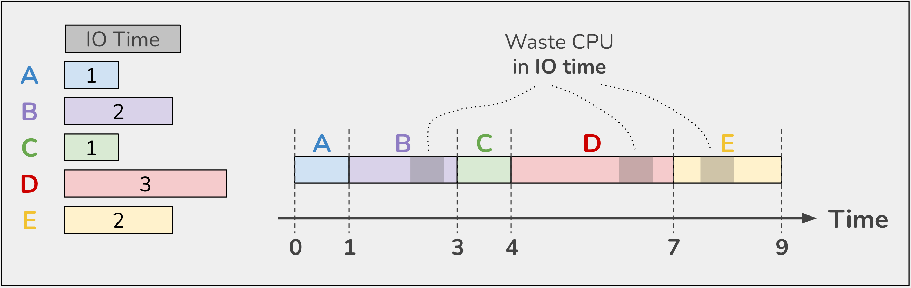
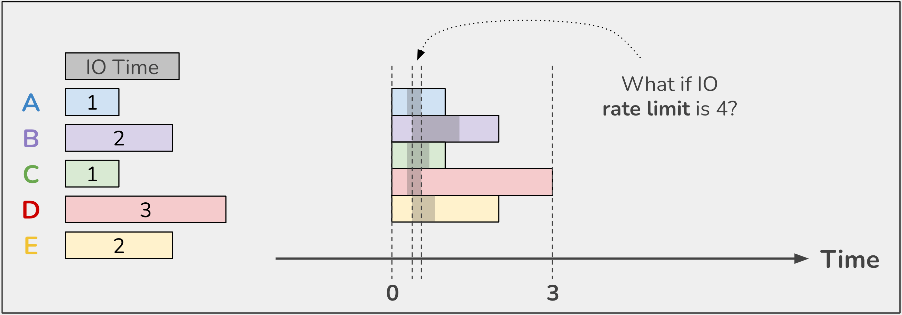
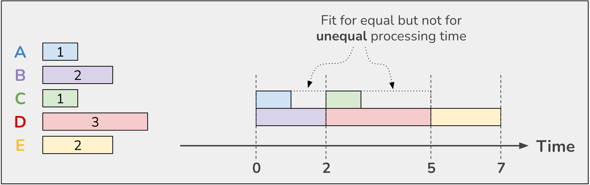
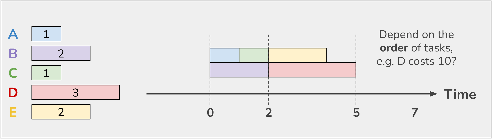

# Utilize CPU with Golang

Blog: https://liamhieuvu.com/utilize-cpu-with-golang

## Level 1: Sequence



```text
$ go run sequence.go
2022/03/18 18:37:47 A start
2022/03/18 18:37:48 A end
2022/03/18 18:37:48 B start
2022/03/18 18:37:50 B end
2022/03/18 18:37:50 C start
2022/03/18 18:37:51 C end
2022/03/18 18:37:51 D start
2022/03/18 18:37:54 D end
2022/03/18 18:37:54 E start
2022/03/18 18:37:56 E end
2022/03/18 18:37:56 processed time: 9.005201125s
```

## Level 2: Burst all jobs



```text
$ go run burst_all.go
2022/03/18 18:38:30 E start
2022/03/18 18:38:30 A start
2022/03/18 18:38:30 D start
2022/03/18 18:38:30 C start
2022/03/18 18:38:30 B start
2022/03/18 18:38:31 C end
2022/03/18 18:38:31 A end
2022/03/18 18:38:32 E end
2022/03/18 18:38:32 B end
2022/03/18 18:38:33 D end
2022/03/18 18:38:33 processed time: 3.001483041s
```

# Level 3: Burst n jobs sequentially



```text
$ go run burst_n.go
2022/03/18 18:39:06 B start
2022/03/18 18:39:06 A start
2022/03/18 18:39:07 A end
2022/03/18 18:39:08 B end
2022/03/18 18:39:08 C start
2022/03/18 18:39:08 D start
2022/03/18 18:39:09 C end
2022/03/18 18:39:11 D end
2022/03/18 18:39:11 E start
2022/03/18 18:39:13 E end
2022/03/18 18:39:13 processed time: 7.003122542s
```

# Level 4: Worker pool



```text
$ go run worker_n.go
2022/03/18 18:39:33 A start
2022/03/18 18:39:33 B start
2022/03/18 18:39:34 A end
2022/03/18 18:39:34 C start
2022/03/18 18:39:35 B end
2022/03/18 18:39:35 D start
2022/03/18 18:39:35 C end
2022/03/18 18:39:35 E start
2022/03/18 18:39:37 E end
2022/03/18 18:39:38 D end
2022/03/18 18:39:38 processed time: 5.002048s
```